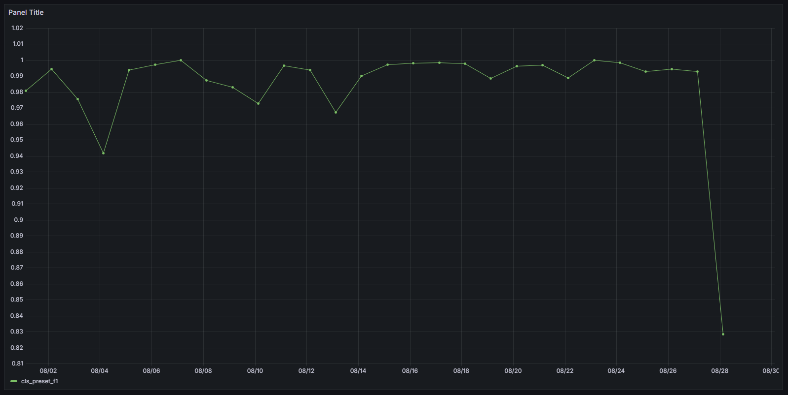

# MLOps-Zoomcamp-M7-Project-Attempt-1-Mushroom-Classification
MLOps-Zoomcamp-M7-Project-Attempt-1-Mushroom-Classification

---

# Development Checklist

## Problem Description
- [x] Describe the problem clearly and thoroughly
- [x] Notebook
- [x] Virtual Environment with `pipenv`

## Cloud Integration
- [x] Ensure cloud services are used for the project
  - [x] Develop on the cloud OR use Localstack (or similar tool) OR deploy to Kubernetes or similar container management platforms
  - [ ] Use Infrastructure as Code (IaC) tools for provisioning the infrastructure

## Experiment Tracking and Model Registry
- [x] Implement experiment tracking
- [x] Register models in a model registry

## Workflow Orchestration
- [x] Implement basic workflow orchestration
- [x] Deploy a fully orchestrated workflow

## Model Deployment
- [x] Deploy the model
  - [x] Deploy the model locally
  - [x] Containerize the model deployment code
  - [x] Ensure the model can be deployed to the cloud or special tools for model deployment are used

## Model Monitoring
- [x] Implement model monitoring
  - [x] Calculate and report basic metrics
  - [ ] Set up comprehensive model monitoring that sends alerts or runs conditional workflows if metrics thresholds are violated (e.g., retraining, generating debugging dashboard, switching to a different model)

## Reproducibility
- [x] Provide clear instructions on how to run the code
  - [x] Ensure all instructions are complete and clear
  - [x] Verify the code works as described
  - [x] Include versions for all dependencies
  - [x] Ensure data is available and accessible

## Best Practices
- [x] Write unit tests
- [x] Write integration tests
- [x] Use a linter and/or code formatter
- [x] Create a Makefile for the project
- [ ] Set up pre-commit hooks
- [ ] Implement a CI/CD pipeline

--- 

# Detailed Descriptions

## Problem Description

**Describe the problem clearly and thoroughly**
- Our project **aims to classify mushrooms** as either **edible or poisonous** based on a set of attributes. This **binary classification** task involves predicting the edibility of a mushroom, which is crucial for foraging and safety purposes.
- Significance: Accurately **predicting whether a mushroom is poisonous** or edible can prevent potential poisoning incidents and ensure safe mushroom consumption.
- Motivation: This project leverages the largest and most comprehensive attribute-based dataset available for mushrooms, including both primary data based on a textbook for mushroom identification and secondary simulated data. The goal is to develop a robust classification model that can be used for educational and practical purposes in mycology.

### Notebook
Exploratory Data Analysis (**EDA**), **Model Training**, **Hyperparameter Optimization** Notebook:
- [MLOps-Zoomcamp-M7-Project-Attempt-1-Mushroom-Classification.ipynb]( MLOps-Zoomcamp-M7-Project-Attempt-1-Mushroom-Classification.ipynb )

### Virtual Environment with `pipenv`

Now let's put everything into a virtual environment. We'll use pipenv for that.

Install all the required libraries. Pay attention to the Scikit-Learn, XGBoost version: it should be the same as in the notebook.

After installing the libraries, pipenv creates two files: `Pipfile` and `Pipfile.lock`.

The `Pipfile.lock` file keeps the hashes of the dependencies we use for the virtual env.

- `Pipfile`: Specifies required packages and versions for the project.
- `Pipfile.lock`: Locks exact package versions for consistent builds.

  ```sh
  ## Install virtualenv management tool
  pip install pipenv --user

  ## Install all the required libraries. Pay attention to the Scikit-Learn version:
  # pipenv install -r requirements.txt
  pipenv install pandas pyarrow
  pipenv install scikit-learn==1.5.0 xgboost==2.0.3 mlflow boto3 s3fs
  pipenv install flask gunicorn
  ## Installing pytest
  pipenv install --dev requests hyperopt
  pipenv install --dev pytest pylint black isort

  ## --where Output project home information.
  pipenv --where
  ## --venv Output virtualenv information.
  pipenv --venv
  ## Enter the Virtual Environment, if required.
  pipenv run python -V
  pipenv shell
  python -V
  ```

## Cloud Integration
**Ensure cloud services are used for the project**
- **Develop on the cloud OR use Localstack (or similar tool) OR deploy to Kubernetes or similar container management platforms**
  - We use **Docker** and **Localstack** to simulate an **S3 bucket** environment.
  - Our scripts are rewritten to ensure compatibility with **AWS S3**, and the Python code is **containerized** for **deployment**.
  - Localstack Emulating 80+ AWS Services, Develop and test your AWS applications locally.
  - **AWS CLI (AWS Command Line Interface)** - [docker-compose.yml]( docker-compose.yml )

    ```sh
    docker-compose up --build localstack

    ## docker exec -it <id-name> sh
    docker exec -it localstack-main sh

    aws --version
    aws configure list
    cat ~/.aws/config

    ## Create a new profile for Localstack in your AWS CLI configuration:
    aws configure --profile localstack

    ## Provide any values for the AWS Access Key ID and AWS Secret Access Key
    ## since Localstack does not validate these credentials.
    aws configure set aws_access_key_id "test" #--profile localstack
    aws configure set aws_secret_access_key "test" #--profile localstack
    aws configure set region "us-east-1" #--profile localstack

    ## Set the S3 Endpoint URL
    # type %USERPROFILE%\.aws\config
    aws configure set s3.endpoint_url "http://localhost:4566" #--profile localstack

    ## Creating a Bucket in Localstack
    aws --endpoint-url="http://localhost:4566" s3 mb "s3://mushroom-dataset"

    ## Checking Bucket Creation
    # aws s3 ls --profile localstack
    aws s3 ls --endpoint-url="http://localhost:4566"

    ## Upload the Input File to Localstack S3, make sure file exist
    aws s3 cp \
        "./data/secondary_data_2023-08.parquet" \
        "s3://mushroom-dataset/in/secondary_data_2023-08.parquet" \
        --endpoint-url="http://localhost:4566"

    ## Checking Bucket
    aws s3 ls "s3://mushroom-dataset/" --endpoint-url="http://localhost:4566"
    aws s3 ls "s3://mushroom-dataset/in/" --endpoint-url="http://localhost:4566"

    ## Delete Bucket
    aws s3 rm --recursive "s3://mushroom-dataset/" --endpoint-url="http://localhost:4566"
    ```

  - **LocalStack AWS CLI (awslocal)**
    - `awslocal` serves as a thin wrapper and a substitute for the standard aws command, 
    enabling you to run AWS CLI commands within the LocalStack environment 
    without specifying the `--endpoint-url` parameter or a profile.
    - Installation:

      ```sh
      ## Optional LocalStack AWS CLI (awslocal)
      # pip install awscli-local[ver1]
      pip install awscli-local

      awslocal --version
      ```
  - **Check Connection `LocalStack`**
    ```sh
    import os
    import boto3
    from pprint import pprint

    ## Setting Up Environment Variables
    ## Load AWS credentials from environment variables
    os.environ['AWS_ACCESS_KEY_ID']     = "test"
    os.environ['AWS_SECRET_ACCESS_KEY'] = "test"
    os.environ['AWS_DEFAULT_REGION']    = "us-east-1"
    ## Set Docker environment variable, export DOCKER_ENV='1'
    os.environ['DOCKER_ENV'] = '1'
    ## Set Localstack S3 endpoint based on Docker environment
    os.environ['AWS_ENDPOINT_URL'] = (
        f"http://{'host.docker.internal' if os.getenv('DOCKER_ENV') else 'localhost'}:4566"
    )
    ## Create a session with the provided credentials
    # s3_client = boto3.Session(
    #     aws_access_key_id = os.getenv('AWS_ACCESS_KEY_ID', 'test'),
    #     aws_secret_access_key = os.getenv('AWS_SECRET_ACCESS_KEY', 'test'),
    #     region_name = os.getenv('AWS_DEFAULT_REGION', 'us-east-1'),
    # ).client('s3', endpoint_url=os.getenv('AWS_ENDPOINT_URL', 'http://localhost:4566'))  # LocalStack S3 endpoint

    ## Create an S3 client with LocalStack endpoint
    s3_client = boto3.client(
        's3',
        aws_access_key_id = os.getenv('AWS_ACCESS_KEY_ID', 'test'),
        aws_secret_access_key = os.getenv('AWS_SECRET_ACCESS_KEY', 'test'),
        region_name = os.getenv('AWS_DEFAULT_REGION', 'us-east-1'),
        endpoint_url=os.getenv('AWS_ENDPOINT_URL', 'http://localhost:4566')  # LocalStack S3 endpoint
    )
    response = s3_client.list_buckets()
    pprint(response)
    ```

- **Use Infrastructure as Code (IaC) tools for provisioning the infrastructure**
  - We use **Terraform** to create the Localstack environment and run the Python container.
  - The Terraform scripts are included in the repository and documented to automate the provisioning and management of our infrastructure.

## Experiment Tracking and Model Registry
**Implement experiment tracking**
- Use tools like MLflow, Neptune, or TensorBoard to track your experiments.
- Document the setup and usage instructions for experiment tracking in your repository.
- [Start the Tracking Server](https://mlflow.org/docs/latest/tracking/server.html#start-the-tracking-server)

  ```python
  ## WE PREFER LOCALLY
  ## https://mlflow.org/docs/latest/tracking/server.html#start-the-tracking-server
  ## Launch MLflow Tracking Server with Local/Remore Storage
  ## 0.0.0.0:5000 (default in Docker mode) 127.0.0.1:5000 (default in host mode)
  python -m mlflow server \
    --host 127.0.0.1 \
    --port 5000 \
    --backend-store-uri "sqlite:///mlruns.db" \
    --default-artifact-root "s3://mushroom-dataset/model/" \
    --serve-artifacts
  ```

- Build mlflow.Dockerfile:

  ```Dockerfile
  ## mlflow.Dockerfile
  ## The official MLflow Docker image is available on GitHub Container Registry at https://ghcr.io/mlflow/mlflow
  ## Use the official Python image from the Docker Hub
  FROM python:3.11-slim

  ## Install required packages
  RUN pip install pip mlflow boto3 s3fs -U

  ## Environment variables for AWS and MLflow
  ENV AWS_ACCESS_KEY_ID="test"
  ENV AWS_SECRET_ACCESS_KEY="test"
  ENV AWS_REGION="us-east-1"
  ENV AWS_ENDPOINT_URL="http://localhost:4566"
  ## Set the tracking URI using an environment variable
  ENV MLFLOW_TRACKING_URI="sqlite:///mlruns.db"
  ENV MLFLOW_HOME="/app"

  ## Expose the port the MLflow server will run on
  EXPOSE 5000

  ## Set the working directory
  WORKDIR "/app"

  ## Command to run the MLflow server
  CMD [ \
    "mlflow", "server", \
    "--host", "0.0.0.0", \
    "--port", "5000", \
    "--backend-store-uri", "sqlite:///mlruns.db", \
    "--default-artifact-root", "s3://mushroom-dataset/model/", \
    "--serve-artifacts" \
  ]
  ```

- And add it to the docker-compose.yaml:

  ```yaml
  ## docker-compose.yaml
  services:
    ## ...
    ## docker-compose up --build mlflow
    mlflow:
      container_name: "mlflow-main"
      ## The official MLflow Docker image is available on GitHub Container Registry at https://ghcr.io/mlflow/mlflow
      build:
        context: .
        dockerfile: "mlflow.Dockerfile"
      working_dir: "/app"
      environment:
        ## Environment variables for AWS and MLflow
        AWS_ACCESS_KEY_ID: "test"
        AWS_SECRET_ACCESS_KEY: "test"
        AWS_REGION: "us-east-1"
        AWS_ENDPOINT_URL: "http://localstack:4566"
        ## Set the tracking URI using an environment variable
        MLFLOW_TRACKING_URI: "sqlite:///mlruns.db"
        MLFLOW_HOME: "/app"
      ports:
        # - "5000:5000"
        - "5001:5000"
      volumes:
        - "./mlruns.db:/app/mlruns.db"  # connect existing db file
      networks:
        - "back-tier"
        - "front-tier"
      command: >
        mlflow server 
          --host 0.0.0.0 
          --port 5000 
          --backend-store-uri "sqlite:///mlruns.db" 
          --default-artifact-root "s3://mushroom-dataset/model/" 
          --serve-artifacts
  ```

- [pycode/preprocess_data.py]( pycode/preprocess_data.py )
- [pycode/train_s3.py]( pycode/train_s3.py )
- [pycode/hpo_s3.py]( pycode/hpo_s3.py )

**Register models in a model registry**
- Register your trained models in a model registry like MLflow Model Registry or Amazon SageMaker Model Registry.
- Ensure that the registration process is automated and documented.
- [pycode/register_model_s3.py]( pycode/register_model_s3.py )

## Workflow Orchestration

**Implement basic workflow orchestration**
- Use workflow orchestration tools like Apache Airflow, Prefect, or Kubeflow Pipelines to automate your data processing and model training workflows.
- Document the setup and usage instructions for workflow orchestration in your repository.
- **🦄 Make data magical**  
  
  > https://github.com/mage-ai/mlops<br>
  > https://github.com/mage-ai/mlops-zoomcamp<br>
  > https://github.com/mage-ai/mage-zoomcamp<br>
  > https://github.com/mage-ai/mage-ai-terraform-templates<br>
  > https://github.com/mage-ai/docker<br>
  > https://github.com/mage-ai/mage-ai<br>
  > https://github.com/mage-ai/machine_learning<br>
  
  ```bash
  ## Clone the Mage
  ## https://github.com/mage-ai/mlops
  git clone https://github.com/mage-ai/mlops.git
  
  ## Change directory into the cloned repo:
  cd mlops
  
  ## Launch Mage and the database service (PostgreSQL).
  ./scripts/start.sh
  ```
  
  > Open http://localhost:6789 in your browser. 
  
  `New pipeline` > `Standard (batch)` > `Name: mushroom_pipeline` > `Create`

  - [pycode/mage_0_ingest_data.py]( pycode/mage_0_ingest_data.py )
  - [pycode/mage_1_preprocess_data.py]( pycode/mage_1_preprocess_data.py )
  - [pycode/mage_2_hpo.py]( pycode/mage_2_hpo.py )
  - [pycode/mage_3_register_model_s3.py]( pycode/mage_3_register_model_s3.py )

**Deploy a fully orchestrated workflow**
- Ensure that your workflows are deployed and running in a production environment.
- Provide documentation and scripts to deploy the workflows.

  
  

## Model Deployment
**Deploy the model**
- **Deploy the model locally**
  - Ensure that the model can be deployed and tested locally.  
  - Making Input and Output Paths Configurable
  - Provide scripts and instructions for local deployment.
  - Batch (offline) inference: [pycode/predict_batch.py]( pycode/predict_batch.py )

- **Containerize the model deployment code**
  - Use Docker or similar containerization tools to containerize your model deployment code.
  - Provide Dockerfiles and instructions for building and running the containers.
  - Batch (offline) inference: [pycode/predict_batch_s3.py]( pycode/predict_batch_s3.py )

- **Ensure the model can be deployed to the cloud or special tools for model deployment are used**
  - Set up deployment to a cloud platform or use specialized tools like AWS SageMaker, Google AI Platform, or Azure ML.
  - Document the cloud deployment process and any specific tools used.
  - Batch (offline) inference: [pycode/predict_batch_s3.py]( pycode/predict_batch_s3.py )
  
  - Build batch.Dockerfile:

    ```Dockerfile
    ## batch.Dockerfile
    ## Use the official Python image from the Docker Hub
    FROM python:3.11-slim

    ## Set the working directory
    WORKDIR /app

    ## Copy the Pipfile and Pipfile.lock to the Docker container
    COPY [ "Pipfile", "Pipfile.lock", "./" ]
    ## Copy your script file to the Docker container
    COPY "pycode/predict_batch.py" "/app/predict_batch.py"
    COPY "pycode/predict_batch_s3.py" "/app/predict_batch_s3.py"
    ## Copy the model directory into the container at /app/model
    # COPY ["model/", "model/"]

    ## Install pipenv
    RUN pip install pip pipenv -U
    ## Install the dependencies using pipenv
    RUN pipenv install --system --deploy

    # Set the command to run your script with default arguments
    ENTRYPOINT ["python", "predict_batch_s3.py"]
    CMD ["2023", "8"]
    ```


### Model Monitoring

**Implement model monitoring**
- **Calculate and report basic metrics**
  - Set up monitoring to track basic metrics like accuracy, precision, recall, and F1 score.
  - Ensure that these metrics are logged and accessible for review.
   - [baseline_model_data.ipynb]( baseline_model_data.ipynb )
   - [debugging_data.ipynb]( debugging_data.ipynb )
- **Set up comprehensive model monitoring that sends alerts or runs conditional workflows if metrics thresholds are violated (e.g., retraining, generating debugging dashboard, switching to a different model)**
  - Implement more advanced monitoring that can trigger actions based on metric thresholds.
  - Document the monitoring setup and the actions taken when thresholds are crossed.
   - [.env]( .env )
   - [config/grafana_datasources.yaml]( config/grafana_datasources.yaml )
   - [config/grafana_dashboards.yaml]( config/grafana_dashboards.yaml )
   - [docker-compose.override.yml]( docker-compose.override.yml )
   - [pycode/evidently_metrics_calculation.py]( pycode/evidently_metrics_calculation.py )
  - [dashboard_cls_preset_f1.json](dashboards/dashboard_cls_preset_f1.json)
  

### Reproducibility
**Provide clear instructions on how to run the code**
- **Ensure all instructions are complete and clear**
  - Write detailed instructions in a README.md or a dedicated documentation file.
  - Include step-by-step guidance on how to set up the environment and run the code.
- **Verify the code works as described**
  - Test the instructions yourself or have someone else follow them to ensure they are accurate.
- **Include versions for all dependencies**
  - Specify the versions of all software dependencies in a requirements.txt or environment.yml file.
    - [Pipfile]( Pipfile )
- **Ensure data is available and accessible**
  - Provide access to the data used in the project, either by including it in the repository or providing links to download it.
  - Ensure any preprocessing steps are well documented.
    - [Secondary Mushroom Dataset]( https://archive.ics.uci.edu/dataset/848/secondary+mushroom+dataset )

### Best Practices
**Write unit tests**
- Write unit tests for your code to ensure individual components work as expected.
- Include instructions on how to run the tests.
- Now we need to install `pytest`:

  ```bash
  pipenv install --dev pytest
  ```

- Next, create a folder `tests` and create two files. One will be
- the file with tests. We can name it `test_batch.py`. 

  ```bash
  mkdir tests
  touch tests/__init__.py
  touch tests/test_batch.py
  ```
    - [tests/test_batch_s3.py]( tests/test_batch_s3.py )

**Write integration tests**
- Write integration tests to ensure different components of your project work together correctly.
- Include instructions on how to run the integration tests.

- Now let's create `integration_test.py`

- We'll use the dataframe we created in (the dataframe for the unit test)
and save it to S3. We don't need to do anything else: just create a dataframe 
and save it.

- We will pretend that this is data for January 2023.

- Run the `integration_test.py` script. After that, use AWS CLI to verify that the 
file was created.

  ```bash
  mkdir integration_test
  touch integration_test/__init__.py
  touch integration_test/integration_test.py

  ## In LocalStack AWS CLI
  aws --endpoint-url=http://localhost:4566 s3 ls --summarize --human-readable --recursive "s3://mushroom-dataset/in/secondary_data_2023-01.parquet"
  aws --endpoint-url=http://localhost:4566 s3 ls --summarize --recursive "s3://mushroom-dataset/in/secondary_data_2023-01.parquet"
  aws --endpoint-url=http://localhost:4566 s3 ls "s3://mushroom-dataset/in/"
  ## Total Objects: 1
  ##    Total Size: 12920
  ```
    - [integration_test/integration_test.py]( integration_test/integration_test.py )

**Use a linter and/or code formatter**
- Set up a linter (e.g., pylint, flake8) and/or a code formatter (e.g., black) to maintain code quality and consistency.
- Include configuration files and instructions.
- Code quality: Linting `Pylint` and Formatting `black`
  - https://pylint.readthedocs.io/en/latest/user_guide/usage/run.html
  - https://black.readthedocs.io/en/stable/usage_and_configuration/the_basics.html

  ```bash
  ## Your code has been rated at 8.86/10 (previous run: 8.86/10, 0.00)
  pipenv run pylint --recursive=y .
  ```

**Create a Makefile for the project**
- Create a Makefile to automate common tasks like setting up the environment, running tests, and deploying the project.
- Document the available Makefile targets and their usage.
- [Makefile]( Makefile )
- [pyproject.toml]( pyproject.toml )

**Set up pre-commit hooks**
- Use pre-commit hooks to enforce code quality checks before commits (e.g., running linters, formatters, and tests).
- Include instructions on setting up the hooks.

**Implement a CI/CD pipeline**
- Set up a Continuous Integration/Continuous Deployment (CI/CD) pipeline using tools like GitHub Actions, Jenkins, or GitLab CI.
- Automate tasks like testing, building, and deploying your project.
- Document the CI/CD setup and provide instructions on how to monitor and manage it.
